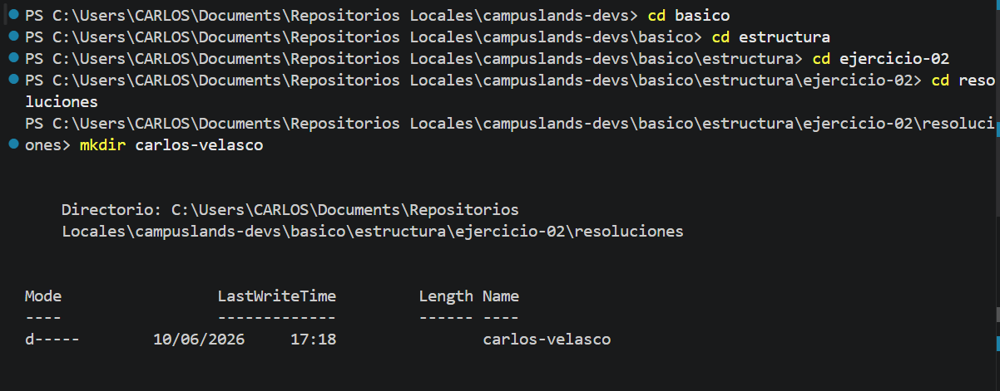
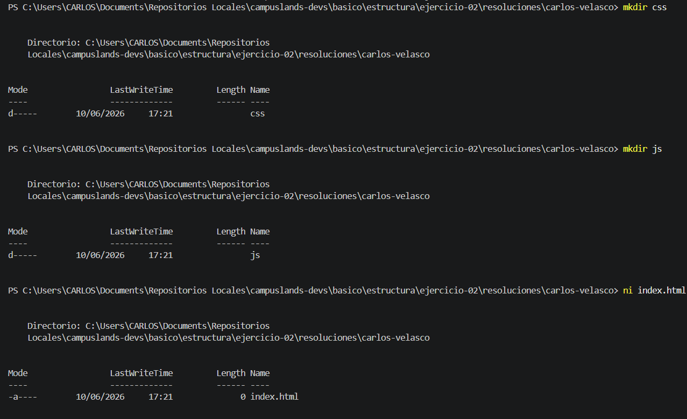
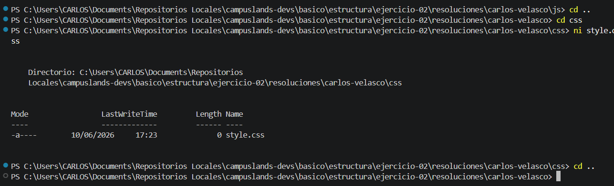
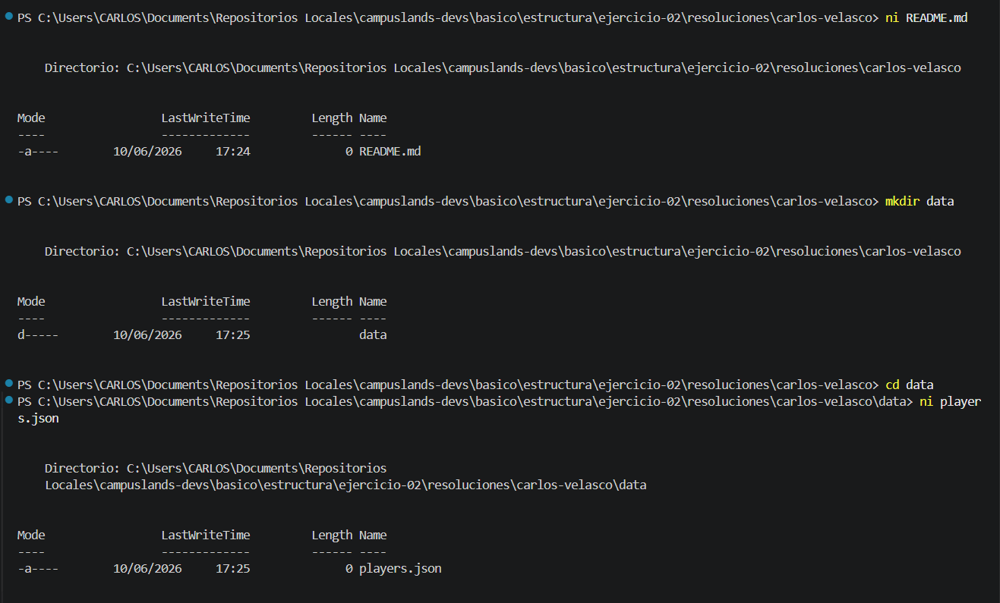

# Ejercicio 02: Proyecto frontend de ranking esports

## Descripción
En este ejercicio se realizó la configuración inicial del entorno de trabajo mediante la línea de comandos en PowerShell. El proceso incluyó:

* **Estructuración de directorios:** Organización de la base mediante carpetas dedicadas para el almacenamiento modular.
* **Inicialización de archivos:** Creación de los archivos base requeridos para el funcionamiento del proyecto en sus respectivas rutas.
* **Navegación y Gestión:** Uso de comandos de sistema (`ni`, `cd`, `mkdir`) para la creación eficiente de elementos y desplazamiento jerárquico.

### Estructura del Proyecto
```text
raiz/
├── css/
│   └── style.css
├── data/
│   └── players.json
├── js/
├── index.html
└── README.md

```

## Comandos Utilizados

Para replicar esta estructura, se utilizaron los siguientes comandos en la terminal:

```powershell
# Crear directorios
mkdir css
mkdir js
mkdir data

# Crear archivos base
ni index.html
ni css/style.css
ni data/players.json
ni README.md

```

---

## Evidencia









**Hecho por:**

* *Carlos Velasco*
