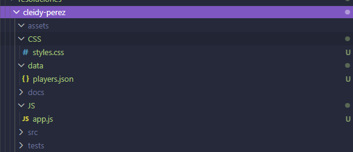
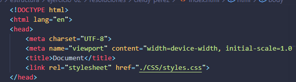
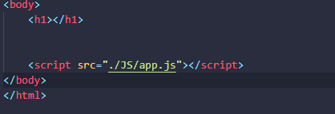
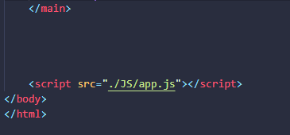

# Proyecto frontend de ranking esports
## Cleidy Priscila Pérez Casia

### Dificultad
Básica retadora

### Temática usada
videojuegos MOBA

### La solución completa.
Para la organización de los documentos y archivos se deben dividir las carpetas que relacionado a lo que se debe trabajar, para que las persona puedan ver en donde se encuentra cada documento que se requiere trabajar.
### Una breve explicación de cómo pensaste el problema.
Cada carpeta debe tener el nombre que se relaciona a los archivos que se van a guardar ahí.
### Evidencia de validación cuando aplique.

-Conectar "CSS" en HTML

-Conectar "JAVASCRIPT" en HTML

-Conectar "JSON" en Javascript

