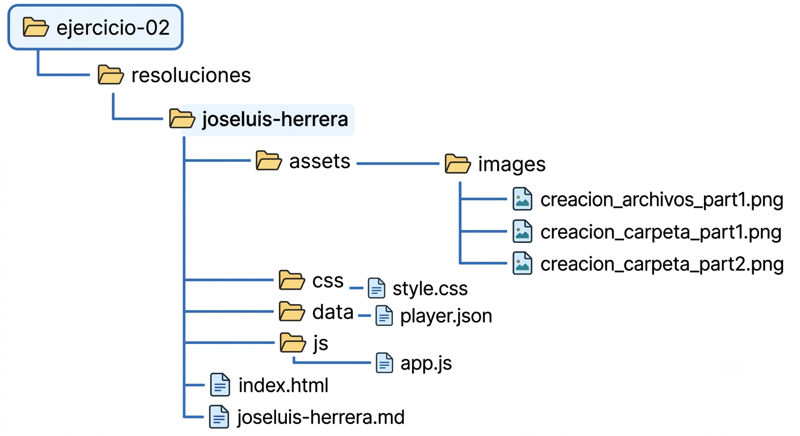
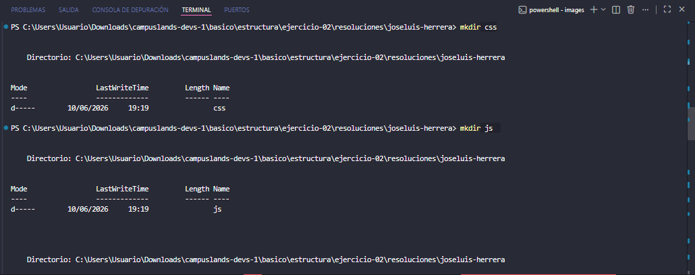
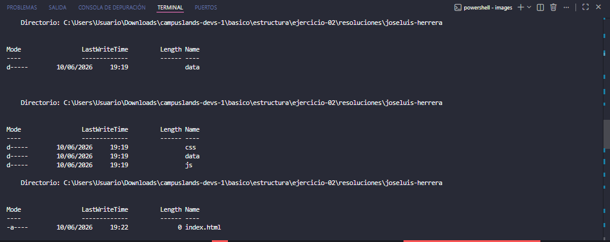
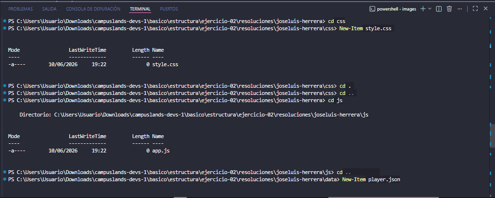

# Estructura de ranking esports

## Estructura
La estructura del proyecto de ranking esports se dividió de la siguiente manera: comenzando con la **creación** de una carpeta llamada `joseluis`, seguido por las subcarpetas  y archivos obligatorias para organizar y los recursos:
* `css`: que contiene el archivo `stile.css`
* `js`: que contiene el archivo `app.js` .
* `data`: para los datos de los players con su archivo `players.json`.
* `assets`: que contiene la carpeta `images`.
* `index.html`: para la interfaz del sistema.

## Estructura Visual




## Conexión entre archivos
La conexion entre los archivos se dividio de la siguiente manera:
* `index.html`: que conecta con los archivos `style.css` y `app.js` 
* `app.js`: que conecta con el archivo `player.json` 

## Conexion 
```
[ style.css ] (Estilos)
            ▲
            │ (Vinculado mediante <link>)
            │
     [ index.html ] (Estructura Base)
            │
            │ (Vinculado mediante <script>)
            ▼
        [ app.js ] (Lógica/JavaScript)
            │
            │ (Petición de datos mediante fetch/import)
            ▼
      [ player.json ] (Datos de los jugadores)
```


## Proceso de Desarrollo 

## Creacion de las carpetas y archivos






## Como se llego a la solucion 
Primero que nada se divido el problema de 3 maneras la primera parte que crear las carpetas y archivos de una manera ordenada ademas de eso siguiendo un orden primero carpetas y luego archivos, en la segunda parte se hizo la conexion entre los archivos y por ultimo punto se llego a la 3 parte se llego a la redaccion del readme la creaciond del arbol visual de como es la estructura y tambien la como se conectan de manera visual.