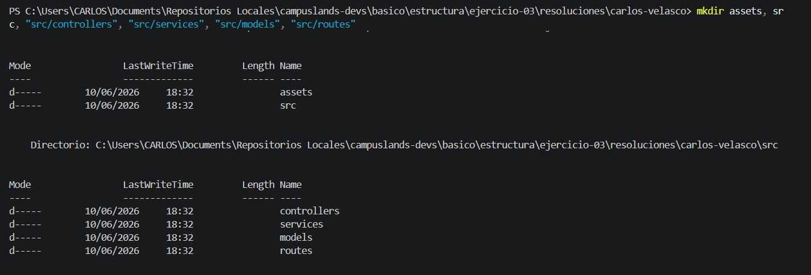
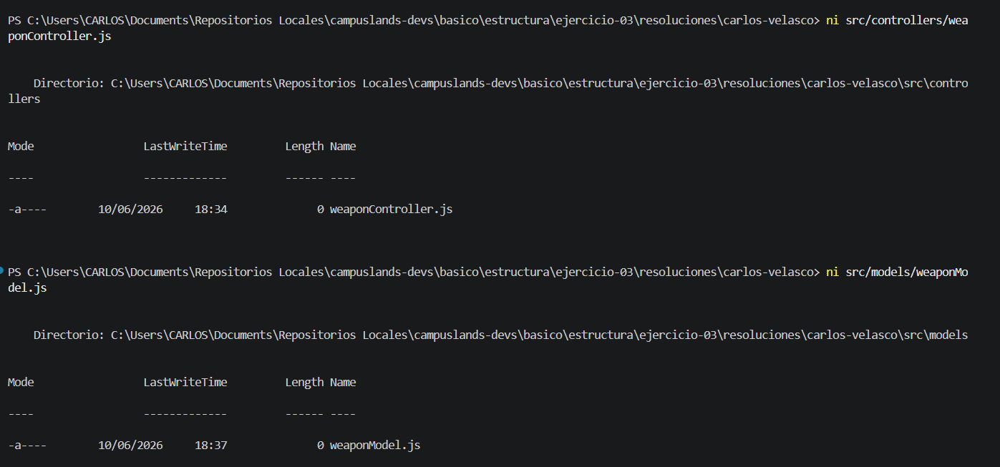
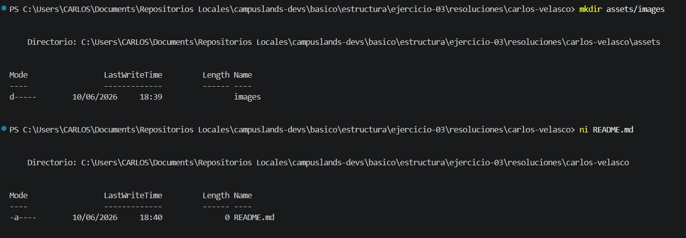

# Ejercicio 03: Backend básico para torneo battle royale

## Descripción

En este ejercicio se realizó la configuración de una estructura de directorios profesional siguiendo un patrón de arquitectura modular.
El proceso incluyó:

* **Estructuración de directorios:** Creación de una jerarquía organizada, separando los activos del proyecto (`assets`) y el código fuente (`src`), el cual se subdividió en capas de lógica para una mejor mantenibilidad.
* **Inicialización de archivos:** Creación de los archivos base fundamentales dentro de las capas correspondientes (Controladores, Modelos, Rutas y Servicios) para definir la estructura del sistema.
* **Navegación y Gestión:** Uso de comandos de sistema para la creación eficiente de múltiples rutas anidadas y archivos mediante la terminal, asegurando una configuración escalable.

### Estructura del Proyecto

```text
raiz/
├── assets/
│   └── images/
├── src/
│   ├── controllers/
│   │   └── weaponController.js
│   ├── models/
│   │   └── weaponModel.js
│   ├── routes/
│   │   └── weaponRoutes.js
│   └── services/
│       └── weaponService.js
└── README.md

```

## Comandos Utilizados

Para replicar esta estructura, se utilizaron los siguientes comandos en la terminal:

```powershell
# Crear directorios principales y sus subdirectorios
mkdir assets, src, "src/controllers", "src/services", "src/models", "src/routes"
mkdir assets/images

# Crear los archivos base en sus rutas correspondientes
ni src/controllers/weaponController.js
ni src/models/weaponModel.js
ni src/routes/weaponRoutes.js
ni src/services/weaponService.js
ni README.md

```

## Evidencia




---

**Hecho por:**

* *Carlos Velasco*