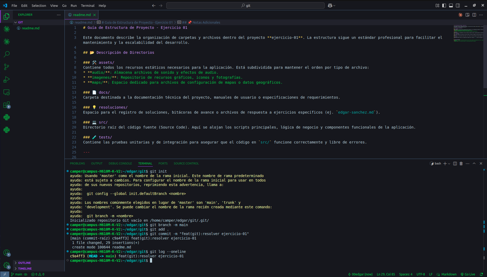

# Ejercicio 01 git

## videncia de uso de cada comando

### - git init
     Inicializacion del repositorio.

### - git branch -m main
     Renombrar la rama "master" a "main".

### - git add .
     Agragar archovos al staged area.

### - git commit -m "feat(git):resolver ejercicio-01"
     Mensaje descriptivo que lo identifica

### - git log --oneline
    Muestra breve resumen de los commit realizados durante el trabajo.

