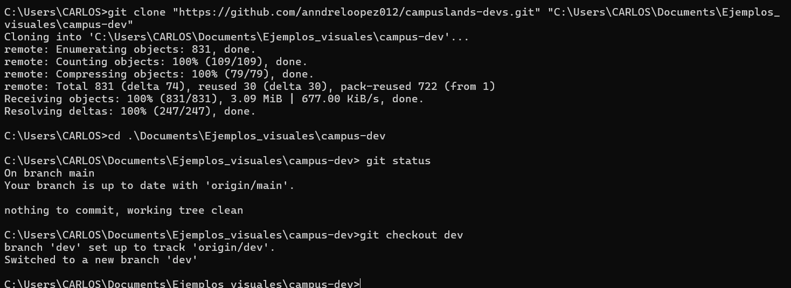

# Ejercicio 02: base de torneo RPG

## Descripción
En este ejercicio se realizó la clonación de un repositorio remoto y la gestión de entornos de trabajo mediante ramas. El proceso incluyó:

* **Clonación de repositorio:** Descarga completa del código fuente desde un repositorio remoto a un directorio local específico.
* **Verificación de estado:** Comprobación del estado del repositorio mediante `git status` para asegurar que el área de trabajo se encuentre limpia y sincronizada.
* **Gestión de ramas:** Cambio de la rama principal (`main`) a la rama de desarrollo (`dev`) utilizando `git checkout` para configurar el entorno de trabajo correspondiente.

### Estructura del Proyecto
```text
raiz/
├── .git/
└── [archivos del repositorio]

```

## Comandos Utilizados

Para replicar esta configuración, se utilizaron los siguientes comandos:

```powershell
# git clone: Descarga una copia del repositorio remoto al equipo local.
git clone "url_del_repositorio" "ruta_destino"

# cd: Cambia el directorio de trabajo actual a la carpeta del proyecto clonado.
cd ruta_destino

# git status: Muestra el estado actual del repositorio (archivos modificados, pendientes, etc).
git status

# git checkout: Cambia a la rama especificada para trabajar sobre ella.
git checkout dev

```

## Evidencia

---

**Hecho por:**

* *Carlos Velasco*
