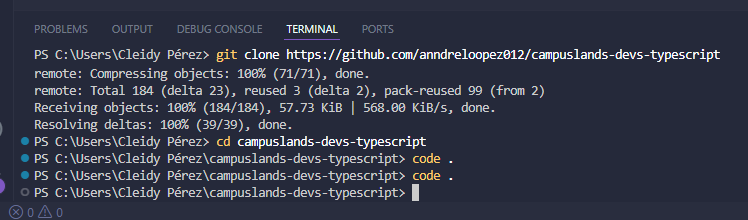
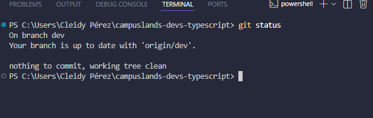

# Clonar base de torneo RPG
## Tu nombre
-Cleidy Priscila Pérez Casia
## Dificultad
-Básica retadora

## Temática usada
-videojuegos RPG

### La solución completa
- Primero se debe crear la carpeta en donde se aguarde el repositorio con "mkdir nombre"
- Segundo debo copiar el link del repositorio que debo trabajar.
- En la terminal de visual Studio escribo "git clone" y pego el link.
- se coloca cd para que se aguarde el repositorio.
- por ultimo "code ." para que me traiga los archivos del repositorio.

### Una breve explicación de cómo pensaste el problema.
Era en donde puedo aguardar esto, esto pensé en crear una carpeta y luego debo llamar y hacer una copia por eso utilizo git clone y cuando lo tengo solo lo agarro y lo aguardo donde se pueda aguarda y conozco donde esta.

### Evidencia de validación cuando aplique.

