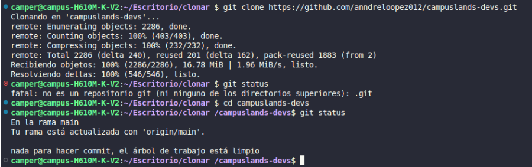

## Observaciones
Lo que se observó en el repositorio clonado es de que se trata de un repositorio de ejercicios de estructura, git y lógica en los cuales unos estudiantes pueden

## Explicacion 
El problema lo plantee de una manera en la cual primero busque el repositorio que debía clonar y luego irme a copiar la url para después poner git clone y pegar la url para clonar el repositorio después quise verificar en que rama estaba ejecutando el comando git status.

