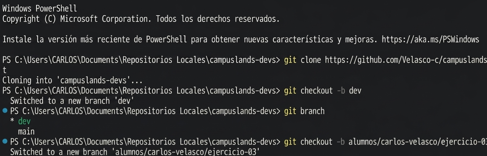

```markdown
# Ejercicio: Clonación y flujo de trabajo con Ramas en Git

## Descripción
En este ejercicio se realizó la configuración inicial del entorno de trabajo mediante Git para gestionar versiones de forma eficiente. El proceso incluyó:

* **Clonación de repositorio:** Descarga del código fuente desde un repositorio remoto para trabajar de forma local.
* **Creación de ramas (`checkout -b`):** Se crearon ramas específicas para separar el entorno de desarrollo (`dev`) y una rama personal para el seguimiento de actividades específicas.
* **Verificación de ramas:** Uso del comando `branch` para visualizar las ramas existentes y confirmar cuál es la rama activa actualmente.

### Estructura del Proyecto
```text
raiz/
├── .git/
└── [archivos del repositorio]

```

## Comandos Utilizados

Para replicar este flujo, se utilizaron los siguientes comandos:

```powershell
# git clone: Descarga el repositorio remoto al entorno local.
git clone "url_del_repositorio"

# git checkout -b: Crea una nueva rama y cambia a ella inmediatamente.
git checkout -b nombre_de_la_rama

# git branch: Lista las ramas existentes y marca con un asterisco la actual.
git branch

# Flujo para guardar y subir cambios a la rama actual:
# git add .: Prepara todos los cambios realizados para ser guardados (staging).
git add .

# git commit -m: Guarda los cambios en el historial local con un mensaje descriptivo.
git commit -m "Mensaje detallando los cambios realizados"

# git push: Envía los commits locales al repositorio remoto en la rama correspondiente.
git push origin nombre_de_la_rama

```

## Evidencia

---

**Hecho por:**

* *Carlos Velasco*
