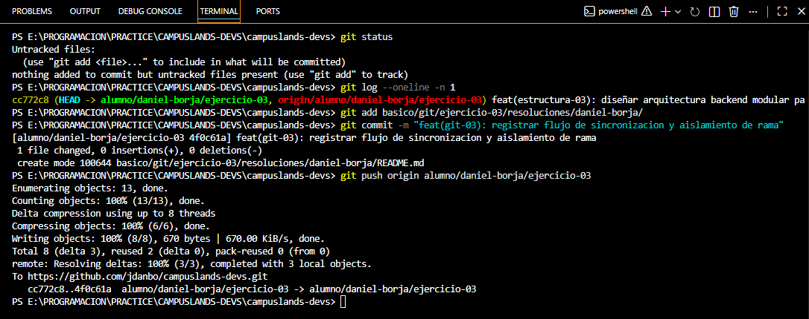

# Solución - Ejercicio 03: Rama Personal para Jugador MOBA

## Análisis de Problema

Se debe de crear una rama desde dev con comandos y trabajar sin afectar a main. 

Al realizar un `git pull origin dev` antes de empezar, me aseguro de limpiar el terreno y traer las últimas "actualizaciones de balance" que mis compañeros de equipo subieron al servidor. Al crear la rama aislada `alumno/daniel-borja/ejercicio-03`, obtengo un carril propio para desarrollar mi código de forma segura sin generar conflictos ni bugs en las líneas principales de producción.

## Evidencia de Comandos y Validación Técnica

A continuación, se detalla la secuencia de comandos ejecutados en consola junto con la validación de estado:

En el bash introducir: 

# Preparación y Sincronización
git checkout dev
    Nos movemos a la rama que estamos trabajando actualmente. 
git pull origin dev
    Descarga e integra al espacio de trabajo todas las actualizaciones
git checkout -b alumno/daniel-borja/ejercicio-03
    Crea y activa la rama de trabajo personal para realizar cambios. 

# Control y Registro
git status
    Muestra el estado del trabajo, verificamos que todo este bien antes de guardar.
git add basico/git/ejercicio-03/resoluciones/daniel-borja/
    Prepara tu carpeta personal y todo lo que tiene adentro, indicándole a Git que estos son los únicos archivos que quieres incluir en tu próximo paquete de entrega.
git commit -m "feat(git-03): registrar flujo de sincronizacion y aislamiento de rama"
    Guarda de forma definitiva en el historial local los cambios que se trabajo en el paso anterior.
git push origin alumno/daniel-borja/ejercicio-03
    Sube tu rama personal con todo tu historial de commits desde mi computadora local hacia mi repositorio en los servidores de GitHub.

# Evidencia
