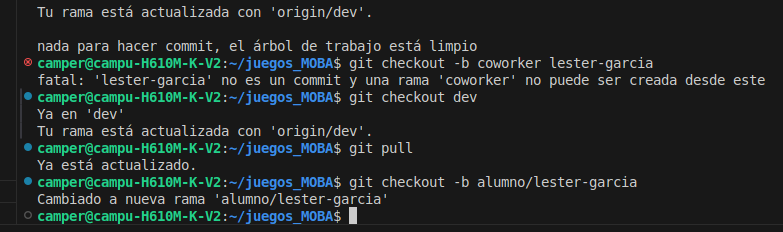
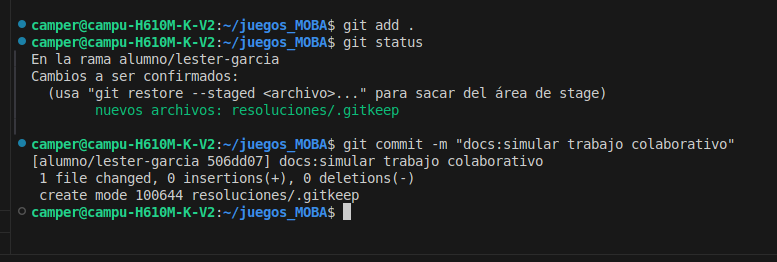

# Simulacion de trabajo colaborativo en un repositorio de git.

### Alumno:Lester Garcia.

## Descripcion:
*Simular el trabajo colaborativo, creando una rama propia y trabajar en ella sin tocar la rama principal main, trabajar en la carpeta indicada y al momento de hacer commit que sea un commit profesional.*
 ## Evidencia:
 1.Moverse a rama dev y desde alli crear la rama de tabajo propia.
   

 
 
 
 2.Agregar cambios a la rama y luego hacer el commit profesional de acuerdo a lo realizado y actualizar su rama de trabajo. 

  

