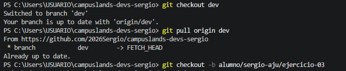

# Sergio Ajú

## Solución

Se creó una rama de trabajo desde `dev` para el ejercicio 03 de Git, respetando el flujo de trabajo colaborativo.

## Flujo realizado

```bash
git checkout dev
git pull origin dev
git checkout -b alumno/sergio-aju/ejercicio-03

```
## Evidencia 

