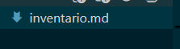
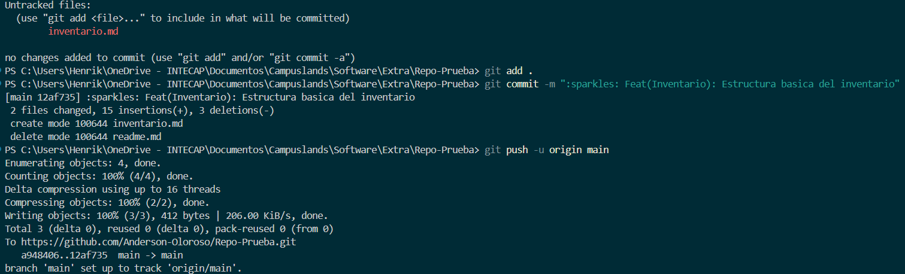
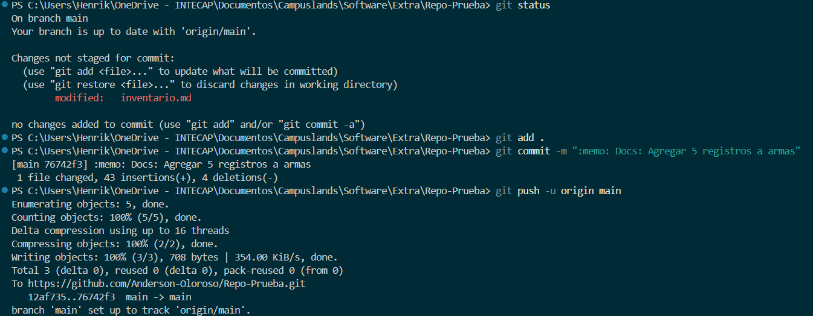
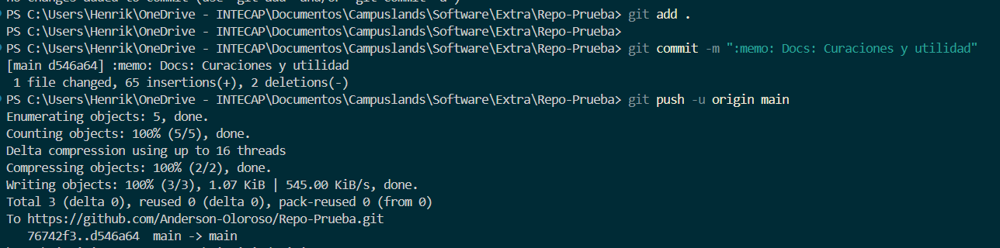
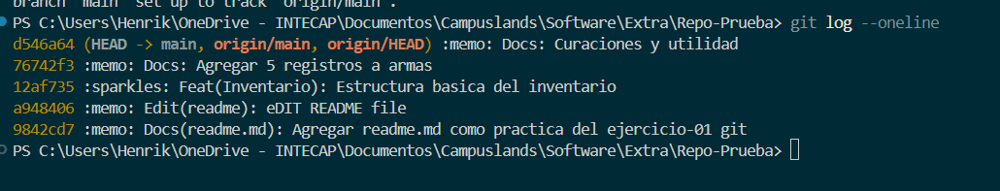

# Ejercicio - 04 Videojuegos Battel Royale
## Henrik Anderson Oloroso García

- Creacion del archivo `inventario.md`

- Commit: Estructura basica

- Commit: armas

- Commit: Curaciones y utilidad

- Ejecucion de: `git log --oneline`

_Justificacion_: Seguí paso a paso las instrucciones del archivo `README.md` y  las imagenes que se muestran son la soluciones.
