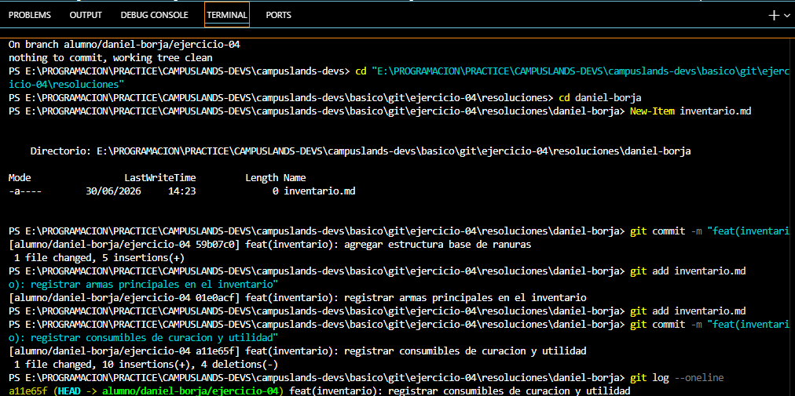

# Ejercicio 04 Git

## Análisis de proyecto
El objetivo de este ejercicio es simular un entorno de trabajo real dividiendo la creación de un inventario para un videojuego Battle Royale de forma incremental a través de tres commits lógicos en Git.

Requerimientos

    Crear una carpeta personal con el formato nombre-apellido (daniel-borja) dentro de la ruta especificada de resoluciones.

    Crear un archivo llamado inventario.md dentro de esa carpeta.

    Primer Commit: Agregar únicamente la estructura general o el diseño del inventario.

    Segundo Commit: Registrar la sección de armas dentro del archivo.

    Tercer Commit: Registrar la sección de curaciones y objetos de utilidad.

    Validar todo el historial de cambios ejecutando el comando de verificación simplificado.

## Resolución

### Primer commit

1. Navegar a la ruta del ejercicio
cd "E:\PROGRAMACION\PRACTICE\CAMPUSLANDS-DEVS\campuslands-devs\basico\git\ejercicio-04\resoluciones"

2. Crear tu carpeta personal obligatoria
mkdir daniel-borja

3. Entrar a tu carpeta
cd daniel-borja

4. Crear el archivo vacío para el inventario
New-Item inventario.md

5. Guardar inventario y commit
git add inventario.md

### Segundo commit
git add inventario.md
git commit -m "feat(inventario): registrar armas principales en el inventario"

### Tercer commit
git add inventario.md
git commit -m "feat(inventario): registrar consumibles de curacion y utilidad"
git log --oneline

