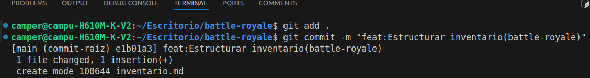
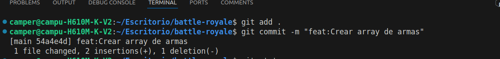
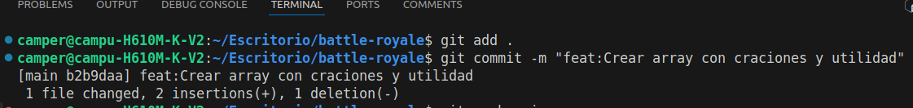
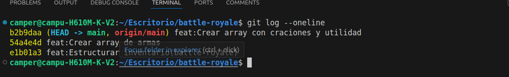

# Simulacion de trabajo colaborativo en un repositorio de git.
## Dividir commits.

### Alumno:Lester Garcia.

## Descripcion:
*Simular el trabajo colaborativo, dividiendo commits y luego mostrar cada commit que se realizó.*
 ## Evidencia:

 1. **git commit -m ""** Elaboracion del primer commit.

 
 
 
 2.**git commit -m ""** :Elaboracion del segundo commit.

  

 3.**git commit -m ""** :  Elaboracion de ltercer commit.

  

4.**git log --oneline** :Mostrar los tres commits que se elaboraron

  
