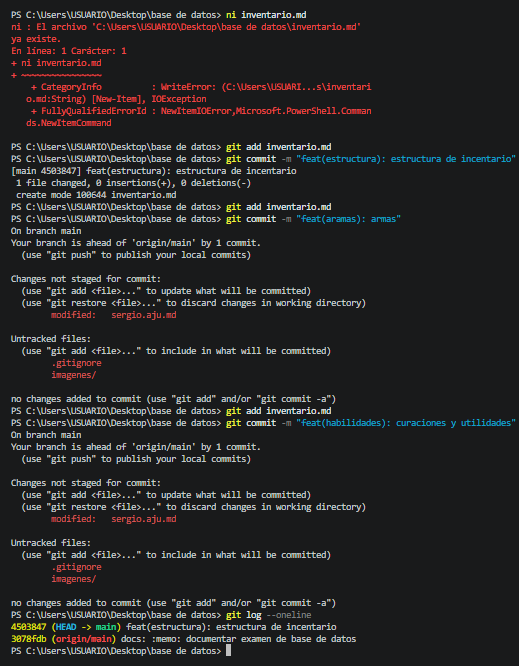

# royale

## Autor 

Sergio Ajú

## Descripcion 

En este ejercicio se realizó la gestión del historial de cambios de un archivo mediante el flujo de trabajo de Git. 
## Temática usada
videojuegos battle royale

## Dificultad
Básica retadora

### La solución completa
Utilizar los git en orden primero se realiza los cambios o lo que debemos realizar y luego de terminar le damos git add . para que se aguarde y git commit -m para colocar el nombre y git log --oneline para ver cuales fueron los commit que se realizaron.

### Evidencia de validación cuando aplique.

