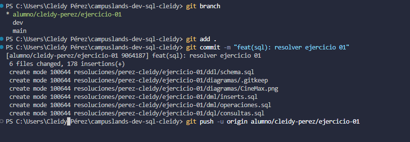
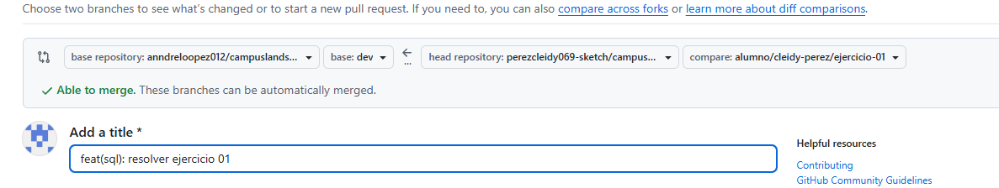

# Push de rama de taller de motos

## Nombre
-Cleidy Priscila Pérez Casia
## Dificultad
-Básica retadora

## Temática usada
motos

## Una breve explicación de cómo pensaste el problema.
Para crear una rama se debe utilizar el git switch -c nombre de la rama.
Cuando se termina de trabajar en esa rama se debe utilizar git add . y git commit -m (lo que se realizó) para que se aguarde y git push -u origin nombre de la rama y con la informacion que sale despues de ejecutar copiar el link en el navegador y de ahi se realizá el merge y pull request y se aguarda los cambio en github.
## Evidencia de validación cuando aplique.
En la terminal de visual studio:

En github:
