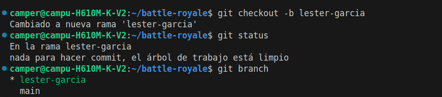
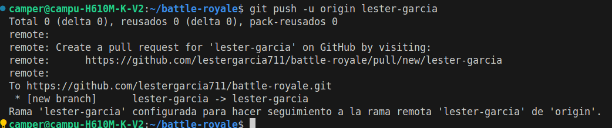
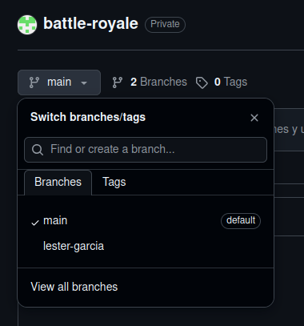

# Simulacion de trabajo colaborativo en un repositorio de git.
## Subir una rama nueva a git.

### Alumno:Lester Garcia.

## Evidencia
1. crear rama nueva.


2.Subir rama al repositorio remoto.



3.Evidencia de la rama en repositorio remoto.




# Guía Técnica: Subir Ramas y Verificar en Git 🚀

Esta guía detalla el proceso estándar para subir una rama de desarrollo local hacia el repositorio remoto en GitHub/GitLab (`git push`) y asegurar de forma precisa que los cambios impactaron en el servidor.

---

##  Paso 1: Subir la Rama Local al Repositorio Remoto

Cuando trabajas en una rama nueva que solo existe en tu computadora, debes indicarle a Git a dónde enviarla la primera vez.

Ejecuta el siguiente comando en tu terminal (reemplaza `nombre-de-tu-rama` por el nombre real de tu rama):

```bash
git push -u origin nombre-de-tu-rama
