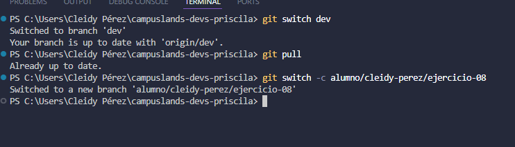

# Pull antes de modificar tabla de fútbol
## Dificultad
Básica retadora

## Nombre
- Cleidy Priscila Pérez Casia

## Temática usada
fútbol

## Explica por qué pull reduce conflictos.
Porque esto trea y fusiona los cambios del servidor locamente antes que uno suba el trabajo de uno.

## Una breve explicación de cómo pensaste el problema.
 Para trabajar en equipo muchas veces necesitamos saber que lo que realizar los demás compañeros para poder trabajar en equipo, entonces en la vida real nosotros nos comunicamos através de dispositivos, pero cuando trabajamos en proyecto es dificil, entonces en este caso se utiliza "git pull" para saber los cambios que se realizaron para saber lo que debemos trabajar y cuando realicemos "git push " no tengamos problemas para subir nuestra tarea.

## Evidencia de validación cuando aplique.

