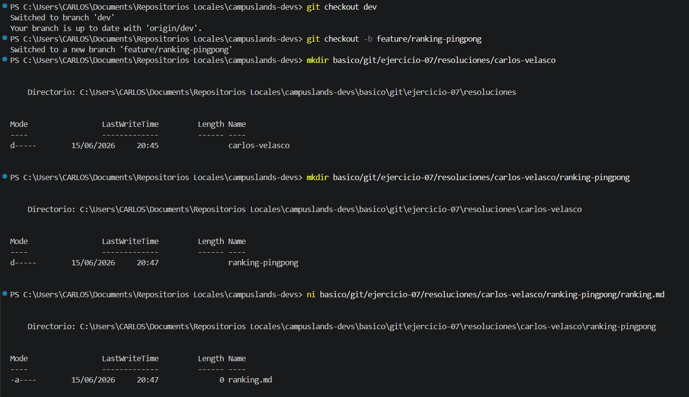
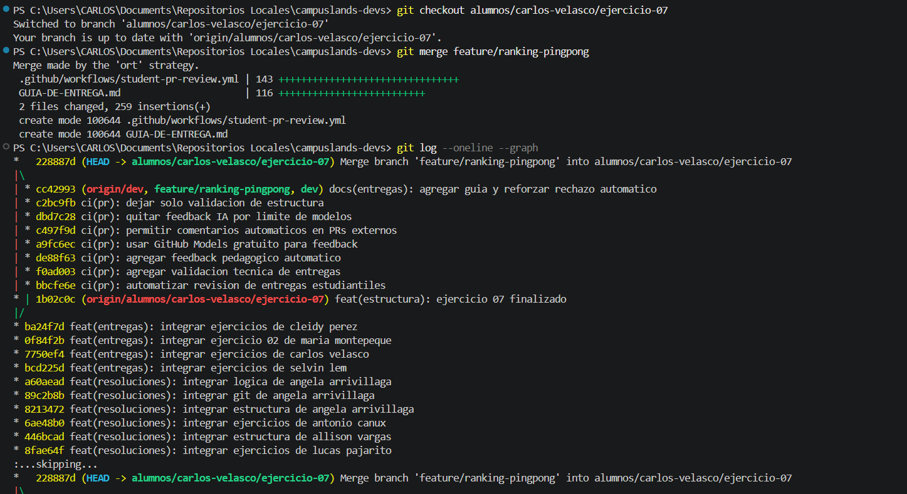

## Estructura y Configuración del Proyecto: Ejercicio-07 (Ranking Ping-Pong)

Se ha completado la configuración del entorno para el desarrollo del **Ejercicio-07**, integrando una nueva funcionalidad de ranking de ping-pong dentro de la estructura del repositorio mediante una rama secundaria y su posterior fusión (merge) en la rama principal del ejercicio.

* **Descripción del proceso:**
* **Gestión de Ramas:** Se creó una rama de trabajo independiente (`feature/ranking-pingpong`) para el desarrollo de la nueva funcionalidad. Tras finalizar la implementación y estructura de archivos, se realizó la transición a la rama base (`alumnos/carlos-velasco/ejercicio-07`) para integrar los cambios.
* **Arquitectura de Directorios:** Se definió la ruta para la nueva funcionalidad (`basico/git/ejercicio-07/resoluciones/carlos-velasco/ranking-pingpong`) asegurando la consistencia en la organización del repositorio.
* **Integración:** Se utilizó `git merge` para consolidar el desarrollo de la funcionalidad en la rama principal del ejercicio, verificando mediante `git log` que el historial de commits reflejara correctamente la fusión.


* **Tecnologías:** Terminal (PowerShell), Git para control de versiones y gestión de ramas.

### Comandos de Git y Shell Utilizados

```bash
# Creación de rama para la nueva funcionalidad
git checkout dev
git checkout -b feature/ranking-pingpong

# Creación de estructura de directorios y archivos
mkdir basico/git/ejercicio-07/resoluciones/carlos-velasco/ranking-pingpong
ni basico/git/ejercicio-07/resoluciones/carlos-velasco/ranking-pingpong/ranking.md

# Registro de cambios en la rama feature
git add .
git commit -m "feat(ranking): estructura inicial de ranking de ping-pong"

# Integración en la rama principal del ejercicio
git checkout alumnos/carlos-velasco/ejercicio-07
git merge feature/ranking-pingpong

# Verificación del historial
git log --oneline --graph

```

### Evidencia





---

**Estructura del Proyecto:**

```text
basico/git/ejercicio-07/resoluciones/carlos-velasco/
└── ranking-pingpong/
    └── ranking.md

```

**Hecho por:**

* *Carlos Velasco*