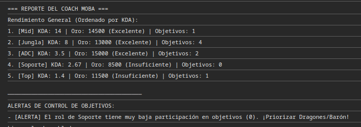

# ⚔️ Sistema de videojuegos MOBA
###  Objetivo:Evaluar jugadores por KDA, oro y control de objetivos.

* **Alumno:** Lester Garcia
* **Proyecto** Sistema de videojuegos MOBA.
* **Lenguaje:** JavaScript (ES6+)

---

## Evidencia.

En la imagen se observa el reporte del coach MOBA

