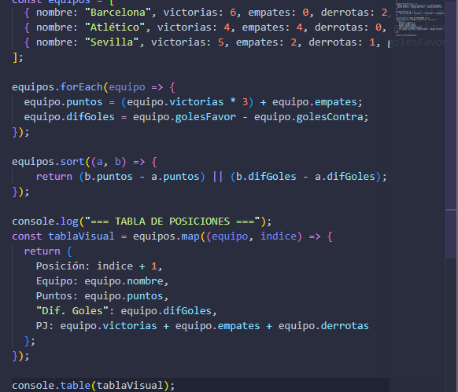

# Tabla de fútbol sala
## Dificultad
Media
### Nombre
- Cleidy Priscila Pérez Casia

### Temática usada
fútbol sala

## Una breve explicación de cómo pensaste el problema.
- Primero se organiza la información y donde se va aguarda entonces utilicé un array para aguardar los datos.
- Debe recorrer se utliza eachfor para que recorra lo datos y se pueda realizar la funcion.

## Evidencia de validación cuando aplique.

