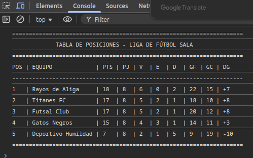

# ⚔️ Sistema para un campeonato de futsala.
###  Calcular puntos, diferencia de goles y ordenar equipos.

* **Alumno:** Lester Garcia
* **Proyecto** Generar tabla para un campeonato d futsala.
* **Lenguaje:** JavaScript (ES6+)

---

## Evidencia.

Aqui se muestra la tabla con cada equipo y su rspectiva puntuacion.

